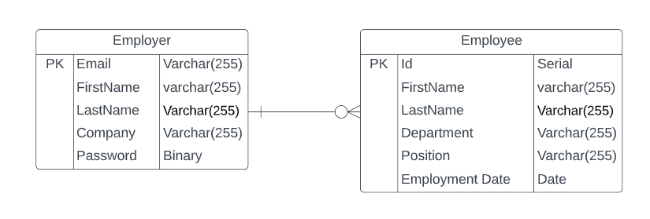

# Staffer API

This is the API for my employment mangagement app Staffer!

Staffer is a employee mangagement app designed to give employers one place to organize all their employee information.

Visit my front-end repo [here.](https://github.com/avongalie/Staffer)
Visit my deployed app [here.](https://avongalie.github.io/Staffer/)

## API URL

```js
  production: 'https://rocky-garden-49816.herokuapp.com/'
```

## API End Points

| Verb   | URI Pattern            | Controller#Action  |
|--------|------------------------|--------------------|
| POST   | `/sign-up`             | `users#signup`     |
| POST   | `/sign-in`             | `users#signin`     |
| DELETE | `/sign-out`            | `users#signout`    |
| PATCH  | `/change-password`     | `users#changepw`   |
| GET    | `/employees`           | `employees#index`  |
| POST   | `/employees`           | `employees#create` |
| GET    | `/employees/:id`       | `employees#show`   |
| PATCH  | `/employees/:id`       | `employees#update` |
| DELETE | `/employees/:id`       | `employees#destroy`|

## Project Planning

Project Planning: Wireframes and [ERD](#entity-reletionship-diagram).
Workflow & Decision Making: Daily work flow checklists.
Problem Solving: Reviewed documentation, consulted 3rd party sites like w3schools.com, meet with TA's.

## Entity Reletionship Diagram



## User Stories
Employers should be able to:
* create an account
* sign in
* change their password
* sign out
* add employees
* update employee information
* remove employees
* search employees by name or department

## Technologies Used
* Node.js
* Express.js
* MongoDB
* Mongoose

## Future Developments
* Addition of comment storage tied to employees.
